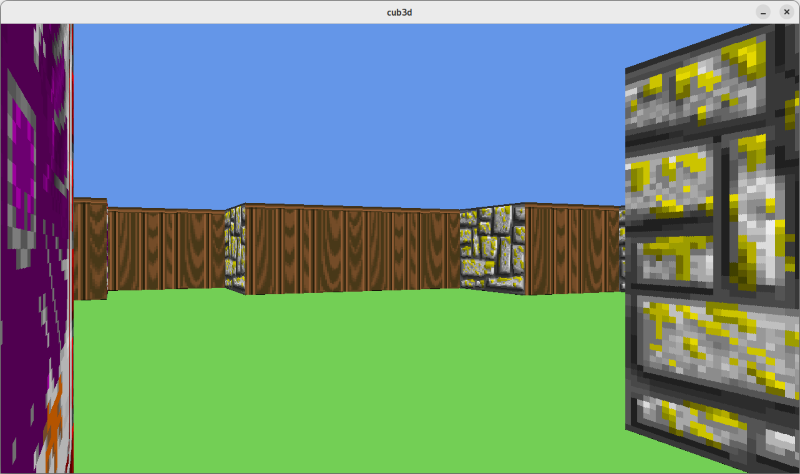

 
# Cub3D

> Proudly made by [Arnaud Biju Duval](https://github.com/ArnaudBD) (abiju-du) and [Théo Vogel](https://github.com/theovgl) (tvogel) !

This project is about reimplementing the raycasting algorithm from the game wolfenstein.

## Screenshots

